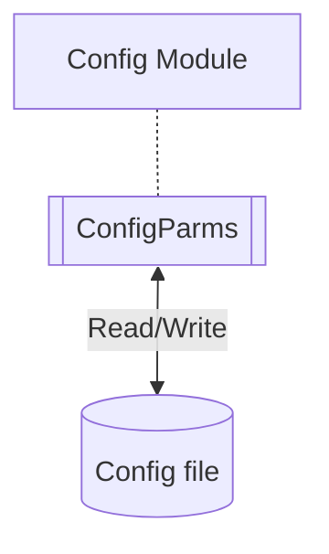

# Config

This module requires python 3.10 due to use of case statement.  The case statement can be changed to if/else structure.

This module is has several functions:
* allow run-time values to be changed and passed into the system without changing source code
* manage the config file, reading parameters into the application, creating the initial file with defaults, updating existing config file if parameters are added or names change
* creating a module that can be used to pass paramters to other modules

## Implementation

The module should be imported as the first application module in each application module.

*`import src.config as cfg`*

The first import reads the config file (`data/xxxxx.cfg`) and loads the runtime values.  If the cfg file does not exist, it is created with the default values.

The config module creates a namespace so variables can be referenced as cfg.var.  The variable is defined with its default in the namespace.  A config file, *`xxxxx.cfg`* is created on the first run if it does not exist.

Any changes to the cfg file in the data folder are local and override the defaults.

If a new variable is added or if the variable name changes, then the version number should be updated.  This will rewrite the local cfg file with the new variable.

### Configuration ###

The general implementation:

Two programs from this repo are needed:
* scr/config.py
* tests/test_config.py

config.py contains the application run parameters and a class ConfigParms which manages the config file.  It reads a xxxxx.cfg file from the data folder.  If the file does not exist, it is created.  The xxxxx.cfg file is not managed by git so changing values in the xxxxx.cfg file does not flag a git change.

It is intended for the config.py file to be modified for the application.  Parameters unique to the application are defined with their defaults.  Replace the var1-3 and m1-2 variables with the variables needed by the application.

The *`sys_cfg_version`* variable must not be deleted, it will be updated as new parameters are added to the config file and the change in this value triggers the rewrite of the file.

The *`cfg_values`* is a dictionary that defines the sections and variables to be written to the config file.  The key to the dictionary is the section and the value is a list of lists with variable name and variable type.  Valid types supported are integer, float, boolean, string, and list.

No coding changes to the class ConfigParms should be needed unless custom formatting of a variable value is needed.

The tests (unittest) should be run to ensure any changes have not broken the module

### Summary of set up ###
* Copy or clone the repository to your local system.
* Extract the src/config.py and tests/test_config.py and place in your project file
* Modify these modules for your application
* Run the test
